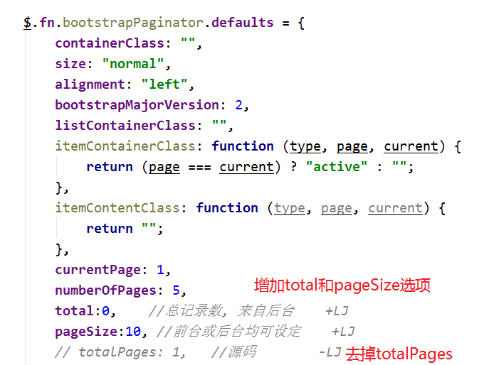
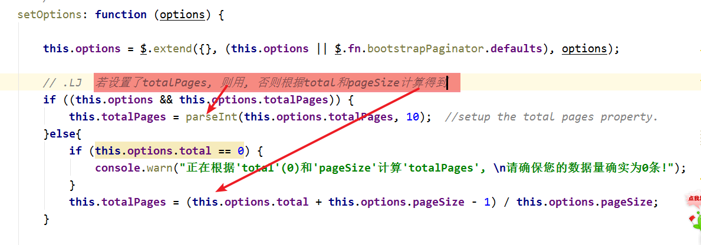

Bootstrap Paginator-lj v1.0
===========================

>   `bootstrap-paginator.js`是一款基于bootstrap框架的很好用的生成分页导航插件.
>   本插件是对原生的`bootstrap-paginator.js`优化版.

**原生插件源码仓库地址**
[GitHub地址](https://github.com/lyonlai/bootstrap-paginator)

**本插件使用案例**
[bootstrap-paginator.js分页插件的优化--增加pageSize和total属性](http://www.jianshu.com/p/a4a969c885cf)

优化思路
--------

### 修改默认参数配置

增加参数

### 修改`setOptions()`

修改setOptions方法

### 优化后效果

上述的普通分页逻辑和bootstrap-paginator特有的分页逻辑均可使用, 
* **普通分页逻辑:** 分页参数设置时, 设置`currentPage`, `pageSize`和`total`.
并用EL表达式接收回显. 
* **bootstrap-paginator的分页逻辑:** 分页参数设置时,
设置`currentPage`和`totalPages`. 并EL表达式接收回显.

Changes
=======

v 1.0

Copyright and License
=====================

Copyright 208 Liu HeJun

Licensed under the Apache License, Version 2.0 (the "License"); you may not use
this file except in compliance with the License. You may obtain a copy of the
License at

<http://www.apache.org/licenses/LICENSE-2.0>

Unless required by applicable law or agreed to in writing, software distributed
under the License is distributed on an "AS IS" BASIS, WITHOUT WARRANTIES OR
CONDITIONS OF ANY KIND, either express or implied. See the License for the
specific language governing permissions and limitations under the License.
